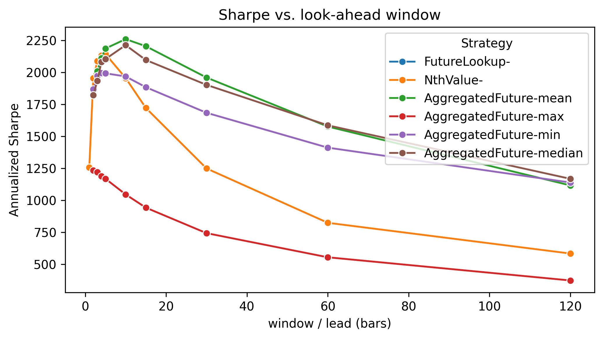

dobyte_test
==============================
Run `setup.sh` to create conda environment, jupyter kernels and setup this project.

# Algorithm design for "optimal biased trading".
NOTE: Assignment says it's allowed to look at future values.\
As the result all backtest stats are not realistic.

All the graphs and tables are just an example of strategy analysis that's a bit beyond the basic stats.

## Basic solution
Naive strategy looks at the next bid and decides whether future bid is higher than current ask.\
If we're holding instruments and next ask is higher than current bid we sell. 

All trading iteration is done by `Backtester` class, including calculation of stats

Some comments and parts of code intentionally ommitted to keep the example simple. Project structure below shows 
where all the code is located.

``` python

class FutureLookupStrategy(Strategy):
    ...
    def future_lookup(..):
        future_idx = min(i + self.offset, len(bid) - 1)
        return bid[future_idx], ask[future_idx]

    def decide(
    ...
    ) -> str:
        fut_bid, fut_ask = self.future_lookup(i, bid, ask)
        if fut_bid > ask[i] and cash >= ask[i]:
            return "buy"
        if shares and fut_ask < bid[i]:
            return "sell"
        return "hold"
```


```
    Final cash value of portfolio 1.25
    First nonzero number of instruments held 17
    Final nonzero number of instruments held 22
```


## Performance metrics
How is returns calculated:
If there is a position holding - multiply by bid to simulate what would've been the cash value of current portfolio.\
Add to cash remainder (what we can't use to buy full position). We're "trying" fully invested but it's frequently 
going to be below 100% due to cash remainder.

Next steps - percent changes of cash position -> returns. Crude but works for simple approach.


```json
{
    'Annualized return (linear)':           24803.453197193317,
    'Annualized turnover (billion times)':  1.8893066468785364,
    'Max drawdown':                         0.005904089264369079,
    'Hit rate':                             0.7060094016008132,
    'Portfolio efficiency':                 1.1390452487215796,
    'Annualized Sharpe':                    1256.288757567864,
    'Sortino ratio':                        1880.5743551860342,
    'Calmar ratio':                         93.67962283621549
}
 ```


Upfront all the other strategies tested:


Some are better at being biased strategies - achieving 40% returns.

Also they're not perfectly correlated - some combo could potentially bring return beyond 40%.


|                      |   FutureLookupStrategy |   NthValueStrategy‑1 |   NthValueStrategy‑2 |   NthValueStrategy‑3 |   NthValueStrategy‑4 |   NthValueStrategy‑5 |   NthValueStrategy‑10 |   NthValueStrategy‑15 |   NthValueStrategy‑30 |   NthValueStrategy‑60 |
|----------------------|------------------------|----------------------|----------------------|----------------------|----------------------|----------------------|-----------------------|-----------------------|-----------------------|-----------------------|
| FutureLookupStrategy |                   1    |                 1    |                 0.72 |                 0.68 |                 0.65 |                 0.64 |                  0.59 |                  0.56 |                  0.54 |                  0.59 |
| NthValueStrategy‑1   |                   1    |                 1    |                 0.72 |                 0.68 |                 0.65 |                 0.64 |                  0.59 |                  0.56 |                  0.54 |                  0.59 |
| NthValueStrategy‑2   |                   0.72 |                 0.72 |                 1    |                 0.84 |                 0.8  |                 0.78 |                  0.7  |                  0.66 |                  0.61 |                  0.55 |
| NthValueStrategy‑3   |                   0.68 |                 0.68 |                 0.84 |                 1    |                 0.87 |                 0.83 |                  0.73 |                  0.69 |                  0.63 |                  0.55 |
| NthValueStrategy‑4   |                   0.65 |                 0.65 |                 0.8  |                 0.87 |                 1    |                 0.87 |                  0.76 |                  0.71 |                  0.64 |                  0.56 |
| NthValueStrategy‑5   |                   0.64 |                 0.64 |                 0.78 |                 0.83 |                 0.87 |                 1    |                  0.78 |                  0.72 |                  0.65 |                  0.57 |
| NthValueStrategy‑10  |                   0.59 |                 0.59 |                 0.7  |                 0.73 |                 0.76 |                 0.78 |                  1    |                  0.81 |                  0.69 |                  0.59 |
| NthValueStrategy‑15  |                   0.56 |                 0.56 |                 0.66 |                 0.69 |                 0.71 |                 0.72 |                  0.81 |                  1    |                  0.74 |                  0.62 |
| NthValueStrategy‑30  |                   0.54 |                 0.54 |                 0.61 |                 0.63 |                 0.64 |                 0.65 |                  0.69 |                  0.74 |                  1    |                  0.69 |
| NthValueStrategy‑60  |                   0.59 |                 0.59 |                 0.55 |                 0.55 |                 0.56 |                 0.57 |                  0.59 |                  0.62 |                  0.69 |                  1    |


You'll see all remaining strategies below.

## Version 2 - look at nth future step 
Same trading logic, modified lookahead function by adding offset

``` python
class NthValueStrategy(FutureLookupStrategy):
    """Look *exactly* ``offset`` bars ahead by overriding ``future_lookup``."""

    def __init__(self, offset: int = 5):
        super().__init__()
        self.offset = offset

    def future_lookup(...):
        future_idx = min(i + self.offset, len(bid) - 1)
        return bid[future_idx], ask[future_idx]
```
## Version 3 - violate requirements - look at window of n future values
Isntead of next value, look at a window of future values.

Aggregation functions applied to window:
- np.mean
- np.median
- np.max
- np.min

``` python
    class AggregatedFutureStrategy(FutureLookupStrategy):
        ,,,
        # override only the peek logic – buying / selling logic stays inherited
        def future_lookup(
            ...
        ):
            start = i + 1
            end = min(i + 1 + self.window, len(bid))
            if start >= end:                                   # nothing ahead
                return bid[-1], ask[-1]
            return self.agg_fn(bid[start:end]), self.agg_fn(ask[start:end])
```

## Violations of assignment summary

Note - all strategies are biased - lookahead is used to make decisions.
This is in compliance with the assignment.

| Strategy                   | O(n) time | O(1) memory | Why (one‑liner)                                         |
| -------------------------- | --------- | ----------- | ------------------------------------------------------- |
| `FutureLookupStrategy`     | **True**  | **True**    | Peeks 1 step, constant work & storage.                  |
| `NthValueStrategy`         | **True**  | **True**    | Fixed *k*‑step peek, still constant per bar.            |
| `AggregatedFutureStrategy` | **False** | **False**   | Re‑processes a window each bar; window‑sized temp list. |
 
# Comparing backtest stats
All strategies are biased, so the stats are not realistic.

## Comparing Portfolio Efficiency Stats
Portfolio efficiency for some windowed functions actually outperform `FutureLookupStrategy` and `NthValueStrategy`

|                                     | nan   | max   | mean   | median   | min   |
|-------------------------------------|-------|-------|--------|----------|-------|
| ('AggregatedFutureStrategy', 2.0)   |       | 1.0   | 1.5    | 1.5      | 1.9   |
| ('AggregatedFutureStrategy', 3.0)   |       | 0.9   | 1.6    | 1.6      | 2.2   |
| ('AggregatedFutureStrategy', 4.0)   |       | 0.9   | 1.7    | 1.7      | 2.3   |
| ('AggregatedFutureStrategy', 5.0)   |       | 0.8   | 1.8    | 1.7      | 2.5   |
| ('AggregatedFutureStrategy', 10.0)  |       | 0.7   | 1.8    | 1.8      | 3.0   |
| ('AggregatedFutureStrategy', 15.0)  |       | 0.6   | 1.8    | 1.7      | 3.2   |
| ('AggregatedFutureStrategy', 30.0)  |       | 0.5   | 1.6    | 1.6      | 3.6   |
| ('AggregatedFutureStrategy', 60.0)  |       | 0.4   | 1.3    | 1.3      | 4.0   |
| ('AggregatedFutureStrategy', 120.0) |       | 0.2   | 1.0    | 1.0      | 4.2   |
| ('FutureLookupStrategy', nan)       | 1.1   |       |        |          |       |
| ('NthValueStrategy', 1.0)           | 1.1   |       |        |          |       |
| ('NthValueStrategy', 2.0)           | 1.6   |       |        |          |       |
| ('NthValueStrategy', 3.0)           | 1.7   |       |        |          |       |
| ('NthValueStrategy', 4.0)           | 1.8   |       |        |          |       |
| ('NthValueStrategy', 5.0)           | 1.7   |       |        |          |       |
| ('NthValueStrategy', 10.0)          | 1.6   |       |        |          |       |
| ('NthValueStrategy', 15.0)          | 1.4   |       |        |          |       |
| ('NthValueStrategy', 30.0)          | 1.1   |       |        |          |       |
| ('NthValueStrategy', 60.0)          | 0.8   |       |        |          |       |
| ('NthValueStrategy', 120.0)         | 0.5   |       |        |          |       |

## Comparing Sharpe Stats
Sharpe is annualized, divided by 1000.\
Sharpes are closer than efficiency.

|                                     | nan   | max   | mean   | median   | min   |
|-------------------------------------|-------|-------|--------|----------|-------|
| ('AggregatedFutureStrategy', 2.0)   |       | 1.2   | 1.8    | 1.8      | 1.9   |
| ('AggregatedFutureStrategy', 3.0)   |       | 1.2   | 2.0    | 1.9      | 2.0   |
| ('AggregatedFutureStrategy', 4.0)   |       | 1.2   | 2.1    | 2.1      | 2.0   |
| ('AggregatedFutureStrategy', 5.0)   |       | 1.2   | 2.2    | 2.1      | 2.0   |
| ('AggregatedFutureStrategy', 10.0)  |       | 1.0   | 2.3    | 2.2      | 2.0   |
| ('AggregatedFutureStrategy', 15.0)  |       | 0.9   | 2.2    | 2.1      | 1.9   |
| ('AggregatedFutureStrategy', 30.0)  |       | 0.7   | 2.0    | 1.9      | 1.7   |
| ('AggregatedFutureStrategy', 60.0)  |       | 0.6   | 1.6    | 1.6      | 1.4   |
| ('AggregatedFutureStrategy', 120.0) |       | 0.4   | 1.1    | 1.2      | 1.1   |
| ('FutureLookupStrategy', nan)       | 1.3   |       |        |          |       |
| ('NthValueStrategy', 1.0)           | 1.3   |       |        |          |       |
| ('NthValueStrategy', 2.0)           | 2.0   |       |        |          |       |
| ('NthValueStrategy', 3.0)           | 2.1   |       |        |          |       |
| ('NthValueStrategy', 4.0)           | 2.1   |       |        |          |       |
| ('NthValueStrategy', 5.0)           | 2.1   |       |        |          |       |
| ('NthValueStrategy', 10.0)          | 2.0   |       |        |          |       |
| ('NthValueStrategy', 15.0)          | 1.7   |       |        |          |       |
| ('NthValueStrategy', 30.0)          | 1.2   |       |        |          |       |
| ('NthValueStrategy', 60.0)          | 0.8   |       |        |          |       |
| ('NthValueStrategy', 120.0)         | 0.6   |       |        |          |       |


## Comparing drawdowns
in basis points\
Important point - other strategies have lower drawdowns than basic lookahead strategy, in some cases 5x improvement.

|                                     | nan   | max   | mean   | median   | min   |
|-------------------------------------|-------|-------|--------|----------|-------|
| ('AggregatedFutureStrategy', 2.0)   |       | 6.1   | 3.4    | 3.4      | 1.9   |
| ('AggregatedFutureStrategy', 3.0)   |       | 6.1   | 3.0    | 2.2      | 1.3   |
| ('AggregatedFutureStrategy', 4.0)   |       | 6.1   | 3.1    | 3.0      | 1.2   |
| ('AggregatedFutureStrategy', 5.0)   |       | 6.1   | 3.1    | 2.1      | 1.1   |
| ('AggregatedFutureStrategy', 10.0)  |       | 6.2   | 1.6    | 1.6      | 1.0   |
| ('AggregatedFutureStrategy', 15.0)  |       | 5.9   | 1.6    | 1.7      | 0.8   |
| ('AggregatedFutureStrategy', 30.0)  |       | 6.2   | 1.6    | 1.6      | 0.8   |
| ('AggregatedFutureStrategy', 60.0)  |       | 6.3   | 1.7    | 1.7      | 0.6   |
| ('AggregatedFutureStrategy', 120.0) |       | 9.3   | 6.0    | 6.0      | 0.6   |
| ('FutureLookupStrategy', nan)       | 5.9   |       |        |          |       |
| ('NthValueStrategy', 1.0)           | 5.9   |       |        |          |       |
| ('NthValueStrategy', 2.0)           | 1.9   |       |        |          |       |
| ('NthValueStrategy', 3.0)           | 1.9   |       |        |          |       |
| ('NthValueStrategy', 4.0)           | 1.7   |       |        |          |       |
| ('NthValueStrategy', 5.0)           | 1.9   |       |        |          |       |
| ('NthValueStrategy', 10.0)          | 1.7   |       |        |          |       |
| ('NthValueStrategy', 15.0)          | 2.0   |       |        |          |       |
| ('NthValueStrategy', 30.0)          | 3.1   |       |        |          |       |
| ('NthValueStrategy', 60.0)          | 6.1   |       |        |          |       |
| ('NthValueStrategy', 120.0)         | 8.3   |       |        |          |       |


## Interactions between stats - optimal values

#### Hitrate - Sharpe interaction


#### Efficiency - Sharpe interaction


#### We can pick max sharpe


#### Or pick more scalable strategy that's 2x more efficient


Project Organization - Minimal
------------

    ├── LICENSE
    ├── Makefile           <- Makefile with commands like `make data` or `make train`
    ├── README.md          <- The top-level README for developers using this project.
    ├── data
    │   ├── processed      <- The final, canonical data sets for modeling.
    │   └── raw            <- The original, immutable data dump.
    ├── notebooks          <- Jupyter notebooks. Naming convention is a number (for ordering),
    │                         the creator's initials, and a short `-` delimited description, e.g.
    │                         `1.0-jqp-initial-data-exploration`.
    ├── reports            <- Generated analysis as HTML, PDF, LaTeX, etc.
    │   └── figures        <- Generated graphics and figures to be used in reporting
    └── src                <- Source code for use in this project.
        ├── __init__.py    <- Makes src a Python module
        ├── alphas         <- Code with strategy logic and backtesting
        │   ├── alpha.py
        │   ├── backtest.py
        │   └── performance.py
        ├── data           <- Scripts to download or generate data
        │   └── make_dataset.py
        │
        └── visualization  <- Scripts to create exploratory and results oriented visualizations
            └── visualize.py
    

--------


Project Organization - Full
------------

    ├── LICENSE
    ├── Makefile           <- Makefile with commands like `make data` or `make train`
    ├── README.md          <- The top-level README for developers using this project.
    ├── data
    │   ├── external       <- Data from third party sources.
    │   ├── interim        <- Intermediate data that has been transformed.
    │   ├── processed      <- The final, canonical data sets for modeling.
    │   └── raw            <- The original, immutable data dump.
    │
    ├── docs               <- A default Sphinx project; see sphinx-doc.org for details
    │
    ├── models             <- Trained and serialized models, model predictions, or model summaries
    │
    ├── notebooks          <- Jupyter notebooks. Naming convention is a number (for ordering),
    │                         the creator's initials, and a short `-` delimited description, e.g.
    │                         `1.0-jqp-initial-data-exploration`.
    │
    ├── references         <- Data dictionaries, manuals, and all other explanatory materials.
    │
    ├── reports            <- Generated analysis as HTML, PDF, LaTeX, etc.
    │   └── figures        <- Generated graphics and figures to be used in reporting
    │
    ├── requirements.txt   <- The requirements file for reproducing the analysis environment, e.g.
    │                         generated with `pip freeze > requirements.txt`
    │
    ├── setup.py           <- makes project pip installable (pip install -e .) so src can be imported
    ├── src                <- Source code for use in this project.
    │   ├── __init__.py    <- Makes src a Python module
    │   │
    │   ├── data           <- Scripts to download or generate data
    │   │   └── make_dataset.py
    │   │
    │   ├── features       <- Scripts to turn raw data into features for modeling
    │   │   └── build_features.py
    │   │
    │   ├── models         <- Scripts to train models and then use trained models to make
    │   │   │                 predictions
    │   │   ├── predict_model.py
    │   │   └── train_model.py
    │   │
    │   └── visualization  <- Scripts to create exploratory and results oriented visualizations
    │       └── visualize.py
    │
    └── tox.ini            <- tox file with settings for running tox; see tox.readthedocs.io


--------

<p><small>Project based on the <a target="_blank" href="https://drivendata.github.io/cookiecutter-data-science/">cookiecutter data science project template</a>. #cookiecutterdatascience</small></p>
